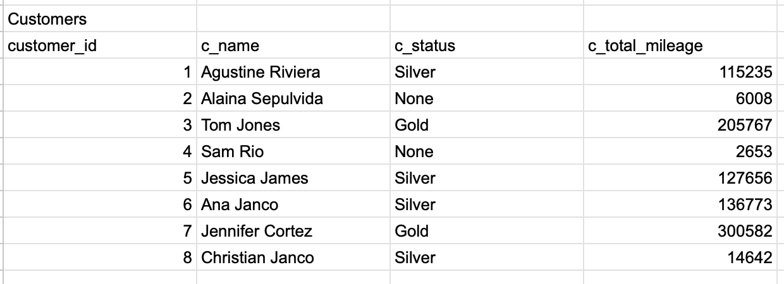

# Enterprise-Java-Development-3.02

### Blog Table
1. Normalize the following blog database and write the DDL scripts to create the database tables:

### Airline Table
2. Normalize the following airline database and write the DDL scripts to create the database tables:

